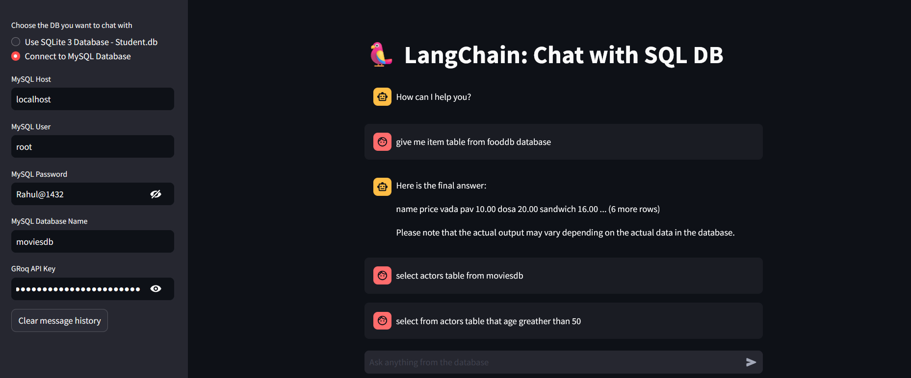

# Chat-with-SQL-Database

# LangChain: Chat with SQL Database

This project is a Streamlit-based web application that allows users to interact with an SQL database (either SQLite or MySQL) via a language model powered by the LangChain framework and ChatGroq's LLM (Large Language Model). Users can ask questions about the database, and the language model will generate SQL queries to fetch and respond with relevant information.

## Features

- **SQLite and MySQL Support**: Users can choose between an SQLite database or connect to a MySQL instance.
- **Natural Language SQL Querying**: Users can type natural language queries, and the LangChain agent will generate and execute SQL queries on the selected database.
- **Chat Interface**: A conversational interface where users can ask queries and see results in real-time.
- **LLM Integration**: Powered by the ChatGroq LLM (`Llama3-8b-8192`) for generating and processing database queries.

## Requirements

- Python 3.8+
- Streamlit 1.23.0+
- LangChain 0.0.45+
- SQLAlchemy 1.4+
- ChatGroq Python SDK
- MySQL (if using a MySQL database)

## Setup and Installation

1. **Clone the Repository**

   ```bash
   git clone https://github.com/your-repo/langchain-sql-chat.git
   cd langchain-sql-chat

 ### Chat Interaction

